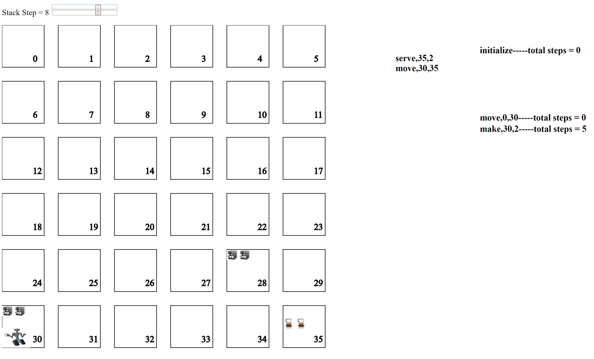

<h1>Coffee Delivery Robot Linear Planner</h1>
<b>MAI-PAR Planning Exercise</b>  
<b>Cole MacLean and Lucky Ekechi</b>  
<b>November 6, 2016</b>  

<h2>Introduction</h2>
A discrete state planning exercise is presented to utilize and test the linear planning with a stack of goals ([PRISM](http://www.cs.cmu.edu/~mmv/planning/readings/strips.pdf)) algorithm for agent planning.  

A mobile robotic agent capable of making and serving coffee to offices within a 2D office building is tasked with efficiently serving the requested coffee petitions in the least amount of steps to reduce office worker disturbances. The office building is modelled as a 6x6 square grid of 36 offices, and the steps between 2 offices is defined as their manhattan distance. The agent is fed information about coffee machine and petition capacities and office locations, and is required to build a daily service plan to efficiently fulfill the petitions given the new office configuration.

The agent is a linear planner with 3 operators: Move, Make and Serve. The preconditions, additions and deletions of each operator in the planning algorithm are listed below.

Make(o,n): the robot makes n cups of coffee in the machine located at office o
<ul>
 <li>Preconditions: robot-location(o), robot-free, machine(o,n)</li>
 <li>Add: robot-loaded(n)</li>
 <li>Delete: robot-free</li>
</ul>

Move(o1,o2): the robot moves from o1 to o2
<ul>
    <li>Preconditions: robot-location(o1), steps(x)</li>
    <li>Add: robot-location(o2), steps(x+distance(o1,o2))</li>
    <li>Delete: robot-location(o1), steps(x)</li>
</ul>

Serve(o,n): the robot delivers n cups of coffee to office o
<ul>
<li>Preconditions: robot-location(o), robot-loaded(n), petition(o,n)</li>
<li>Add: served(o), robot-free</li>
<li>Delete: petition(o,n), robot-loaded(n)</li>
</ul>

A linear planner using these operators and some simple search heuristics has been implemented and can be tested [here](http://ponderinghydrogen.pythonanywhere.com/) The stack of goals is displayed on the left and current plan with total robot travelled steps is on the right.


<h2>Algorithm Implementation</h2>

<b>Initialization</b>  
The Planner class is initializated with the initial state of the form   
                              {'robot-location': o, 'steps': 0,  
                              'petitions': {office:petition_count},  
                              'robot-free': True, 'robot-loaded': 0,  
                              'machines': {office:capacity},  
                              'served': []}


```python
import Planner
import importlib
importlib.reload(Planner)
```


    <module 'Planner' from 'C:\\Users\\macle\\Desktop\\UPC Masters\\Semester 2\\PAR\\planning_exercise\\Planner.py'>


```python
my_planner = Planner.Planner({'robot-location': 0, 'steps': 0,
                              'petitions': {2: 1, 10: 3, 11: 1, 12: 2, 24: 1},
                              'robot-free': True, 'robot-loaded': 0,
                              'machines': {3: 3, 7: 1, 20: 2, 22: 1,30:2},
                              'served': []})
```

<b>Goal Stack</b>  
Tthe Planner object has a propert 'stack' that contains the current elements in the stack of goals of the planner. The stack is initialed with the goal conditions of the goal state (ie offices to serve)


```python
my_planner.stack
```


    [('served', 24), ('served', 2), ('served', 11), ('served', 12), ('served', 10)]


The planner starts with the goal conditions in the stack and searches for the required operators that have in their add list one of the conditions in the stack (ie. operator ['serve', [11, 1]]] has ('served', 11) as an element in it's add list add list). If an operator is found, the goal condition is popped from the goal stack and the operator is added


```python
my_planner.update_stack()
```


    [('served', 24),
     ('served', 2),
     ('served', 10),
     ('served', 12),
     ['serve', [11, 1]]]


If the planner encounters an operator in the goal stack, it checks if the operators preconditions are satisfied in the current state and adds the preconditions to the stack that do not hold.


```python
my_planner.update_stack()
```


    [('served', 24),
     ('served', 12),
     ('served', 10),
     ('served', 2),
     ['serve', [11, 1]],
     ('robot-location', 11),
     ('robot-loaded', 1)]


These added preconditions to the stack become subgoals that the planner searches for an operator to satisfy the same as for the final goal state goals.


```python
my_planner.update_stack()
```


    [('served', 24),
     ('served', 12),
     ('served', 10),
     ('served', 2),
     ['serve', [11, 1]],
     ('robot-location', 11),
     ['make', [7, 1]]]


```python
my_planner.update_stack()
```


    [('served', 24),
     ('served', 12),
     ('served', 10),
     ('served', 2),
     ['serve', [11, 1]],
     ('robot-location', 11),
     ['make', [7, 1]],
     ('robot-location', 7)]


```python
my_planner.update_stack()
```


    [('served', 24),
     ('served', 12),
     ('served', 10),
     ('served', 2),
     ['serve', [11, 1]],
     ('robot-location', 11),
     ['make', [7, 1]],
     ['move', [0, 7]]]


If an operator in the stack has all of it's preconditions satisfied, it is added to the end of the plan and the current state is updated by applying the operator, and the operator is popped from the goal stack.


```python
my_planner.update_stack()
```


    [('served', 24),
     ('served', 12),
     ('served', 10),
     ('served', 2),
     ['serve', [11, 1]],
     ('robot-location', 11),
     ['make', [7, 1]]]


```python
my_planner.plan
```


    ['initialize', ['move', [0, 7]]]


This procedure is repeated until the goal stack is empty


```python
my_planner.build_plan()
my_planner.plan
```


    ['initialize',
     ['move', [0, 7]],
     ['make', [7, 1]],
     ['move', [7, 11]],
     ['serve', [11, 1]],
     ['move', [11, 22]],
     ['make', [22, 1]],
     ['move', [22, 2]],
     ['serve', [2, 1]],
     ['move', [2, 3]],
     ['make', [3, 3]],
     ['move', [3, 10]],
     ['serve', [10, 3]],
     ['move', [10, 22]],
     ['make', [22, 1]],
     ['move', [22, 24]],
     ['serve', [24, 1]],
     ['move', [24, 30]],
     ['make', [30, 2]],
     ['move', [30, 12]],
     ['serve', [12, 2]],
     'finished']


<b>Planning Heuristics</b>  
Two heuristics have been added to the planning algorithm to increase it's ability to find more efficient plans. These heuristics are:
1. Order the service goals in the stack by the closest (manhattan distance) machine that can serve a requested that petition to the location of the robot in the current state
2. Order the make operations in the stack to the closest (manhattan distance) machine to the robot in the current state

These heuristics ensure that the robot performs an availible action that is closest to it's current position, eliminating the amount of times it backtracks, making for more efficient plans.

<h2>Final Results</h2>  
Using a simple linear planner with stack of goals and simple search space heuristics, an efficient agent for coffee service planning can be implemented. Through many different office configurations, the implemented agent performs logically and efficiently in collecting and serving petitions. In the simple case of diagaonal petitions an machines, the robot acts as expected by traversing directly diagonly along the service route, resulting in 10 steps. Similarily, with the simple diaganol petitions but in different machine capacity orders, the robot performs logically by serving the office with the machine of capacity the same as it's initial office, resulting in a total of 18 steps. The plan also performs effectively are more complicated office configurations.


<h2>Limitations</h2>
The described linear planner implementation does not gaurentee maximally optimal service plans. Although the search hueristics help to discover more efficient plans, there does exist situations where the agent will perform sub-optimally. These cases arise when a coffee machine that can serve a petition is closer to that petiton, to another capable machine closer to the agent, causing the agent to unnecessarily backtrack to a less optimal machine. An example configuration of this is presented here.


Future work to improve the above implementation and correct this suboptimal behaviour would be to implement non-linear planning algorithms to discover optimal plans. However, the advantages of the above implementation is its superior ability to scale to larger input configuration, compared to the computationally expensive method of some non-linear planning algorithms. 

<h2>Execution Instructions</h2>
A graphical interface for the described agent can be found [here](http://ponderinghydrogen.pythonanywhere.com/) To initialize the agent, fill in the desired coffee machine capacities and petitions in the correct offices and input the initial office of the robot in the 'robot_cell' input box. For example, if office 16 has a machine with capacity of 3 cups, and office 23 has a petition for 2 cups, input 3 in the 'machines' input box of office 16, and 2 in the 'petitions' input box of office 23. If the agent starts in office 2, enter 2 in the 'robot_cell' input box. Once configured, select the 'Submit' button.  
You will be redirected to a graphical simulation of the agents plan, that can be stepped through using the 'Stack Step' slider to visualize plan execution.
